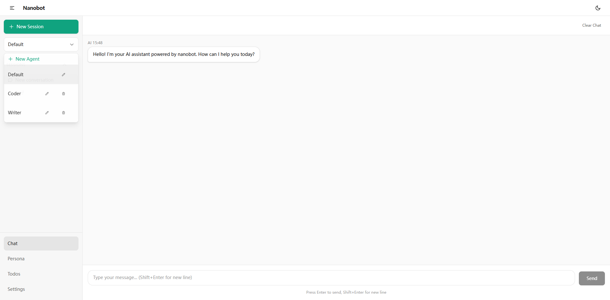

# nanobot-web

Web interface for [nanobot](https://github.com/HKUDS/nanobot) - an ultra-lightweight personal AI assistant.



## What is this?

nanobot-web is the web frontend for nanobot, providing a modern chat interface to interact with AI assistants. It works with the nanobot backend to provide:

- 💬 Chat with AI assistants
- 🎭 Custom agent personas (create, edit, delete)
- 🌙 Dark/Light theme toggle
- 💾 Session history (saved in browser localStorage)
- ⚙️ API configuration (supports multiple LLM providers)

## Supported LLM Providers

- MiniMax
- OpenAI
- DeepSeek
- Moonshot (Kimi)
- Qwen
- vLLM (local models)
- And more...

## Quick Start

### Prerequisites

- [nanobot](https://github.com/HKUDS/nanobot) backend running
- Node.js 18+

### Run with Backend

1. Start the nanobot backend:
   ```bash
   python nanobot/web_server.py
   ```

2. Start the frontend:
   ```bash
   cd nanobot-web
   npm install
   npm run dev
   ```

3. Open http://localhost:5173

### Run Standalone (Production)

1. Build the frontend:
   ```bash
   cd nanobot-web
   npm install
   npm run build
   ```

2. The backend will serve the built files automatically at http://localhost:5173

## Usage

### Configuring API

Go to Settings page to configure your LLM provider and API key.

### Creating Custom Agents

1. Click the agent dropdown in the sidebar
2. Click "New Agent"
3. Enter agent name
4. Write the agent prompt
5. Click Save

Agent prompts are stored in `~/.nanobot/agents/` directory.

### Chat

Type messages and press Enter to send. Use Shift+Enter for new lines.

## Project Structure

```
nanobot-web/
├── src/
│   ├── components/
│   │   ├── layout/     # Layout components (Sidebar, TopBar, Layout)
│   │   └── ui/        # Reusable UI components
│   ├── contexts/       # React contexts (Session management)
│   ├── hooks/         # Custom hooks
│   ├── pages/         # Page components (Chat, Settings, Persona, Todos)
│   └── types/         # TypeScript type definitions
├── public/            # Static assets
└── dist/             # Built production files
```

## Related Projects

- [nanobot](https://github.com/HKUDS/nanobot) - The backend AI assistant
- [nanobot-docs](https://github.com/HKUDS/nanobot-docs) - Documentation

## License

MIT License - see LICENSE file for details.

You can also install [eslint-plugin-react-x](https://github.com/Rel1cx/eslint-react/tree/main/packages/plugins/eslint-plugin-react-x) and [eslint-plugin-react-dom](https://github.com/Rel1cx/eslint-react/tree/main/packages/plugins/eslint-plugin-react-dom) for React-specific lint rules:

```js
// eslint.config.js
import reactX from 'eslint-plugin-react-x'
import reactDom from 'eslint-plugin-react-dom'

export default defineConfig([
  globalIgnores(['dist']),
  {
    files: ['**/*.{ts,tsx}'],
    extends: [
      // Other configs...
      // Enable lint rules for React
      reactX.configs['recommended-typescript'],
      // Enable lint rules for React DOM
      reactDom.configs.recommended,
    ],
    languageOptions: {
      parserOptions: {
        project: ['./tsconfig.node.json', './tsconfig.app.json'],
        tsconfigRootDir: import.meta.dirname,
      },
      // other options...
    },
  },
])
```
